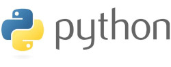

# 1. Python

Python é unha linguaxe de programación de alto nivel, interpretada e de propósito xeral. Trátase dunha linguaxe multiparadigma, xa que soporta programación estruturada e programación orientada a obxectos. Python conta cunha biblioteca estándar moi extensa e unha ampla comunidade de usuarios e programadores..

Administrado pola **Python Software Foundation** ten unha licenza de código aberto. Actualmente é unha das linguaxes máis populares e a que máis se utiliza en diferentes ámbitos: desenvolvemento web, análise de datos, intelixencia artificial, *scripting*,etc. Algunhas das grandes *apps* do memento están desenvolvidas total ou parcialmente nesta linguaxe: Instagram, Netflix, Spotify, etc.

Esta linguaxe ten a súa orixe nos anos 80. Na actualizade utilízase **Python 3**, xa que dende o 2020 non se mantén **Python 2**. A documentación de **Python 3** podémola atopar no seguinte enlace: https://docs.python.org/3/