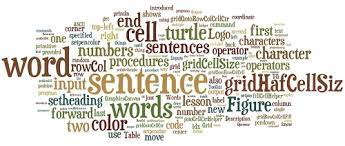

# 2. Primeiros pasos: execución secuencial

Como vimos no apartado 2, os programas informáticos en **Python** e en calquera outra linguaxe está constituída por instrucións. Unha **instrución** é unha acción básica que pode formar parten dun algoritmo.

En **Python**, cada liña é unha instrución. Polo tanto, cada instrución separase cun salto de liña. Noutras linguaxes, as instrucións poden separarse por exemplo con outros caracteres. É moi común que este carácter sexa o ";".

En xeral, as instrucións execútanse unha despois de outra, na orde na que están escritas. É dicir, en secuencia. Este proceso coñécese como **execución secuencial**.

Nos seguintes apartados, veremos os diferentes compoñentes que compoñen unha instrución.

