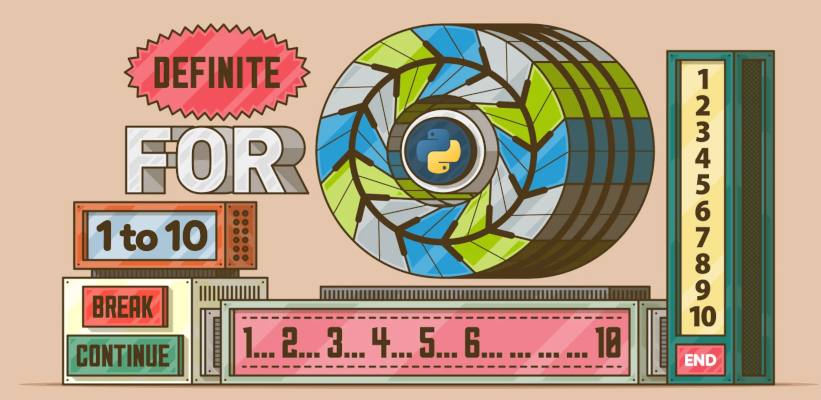

# 5. Estruturas iterativas

As estruturas de control **iterativas, de repetición ou bucles**, facilitan a repetición dun bloque de instrucións un número determinado de veces ou mentres se cumpra unha condición.

En **Python**, e na maioría de linguaxes, existen dous tipos de estruturas iterativas: `for` e `while`. Nos seguintes apartados veremos a sentenza `while`, mentres que a `for` verémola no apartado de cadeas de texto.
