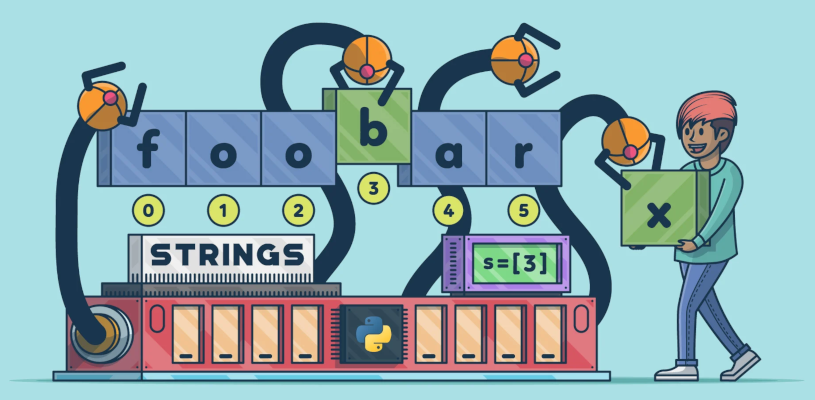
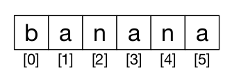

# 6. Cadeas



Unha cadea ou **string** é unha **secuencia de caracteres**. Podes acceder aos caracteres dun en un co operador corchete:

```python
froita = 'banana'
letra = froita[1]
```

A segunda sentenza extrae o carácter na posición do índice 1 da variable **froita** e asigna a variable **letra**.

A expresión nos corchetes chamase **índice**. O índice indica que carácter da secuencia queres. Pero poderías non obter o que esperas:

```python
print(letra) # Imprime: a
```

Así que "b" é a letra co índice 0 de "banana", "a" é a letra co índice 1, e "n" é a que ten índice 2, etc.

Podes usar calquera expresión, incluíndo variables e operadores, como un índice, pero o valor do índice ten que ser sempre un enteiro:

```python
letra = froita[1.5] # TypeError: string indices must be integers
```


