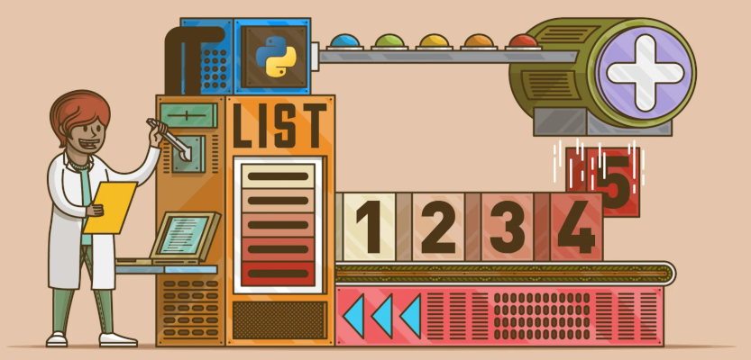

# 7. Listas

Do mesmo xeito que unha cadea, unha **lista** é unha secuencia de valores. Nunha cadea, os valores son caracteres; nunha lista, poden ser de calquera tipo. Os valores dunha lista son chamados **elementos**.