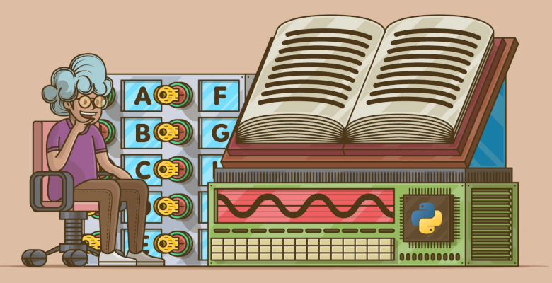

# 9. Diccionarios

Un **dicionario** é como unha lista, pero máis xeral. Nunha lista, os índices de posicións teñen que ser enteiros; nun dicionario, os **índices poden ser de calquera tipo**.

Podes pensar nun dicionario como unha asociación entre un conxunto de índices (que son chamados **chaves**) e un conxunto de valores. Cada clave apunta a un valor. A asociación dunha clave e un valor é a chamada **par chave-valor** ou **elemento**. É un formato similar a un JSON.
