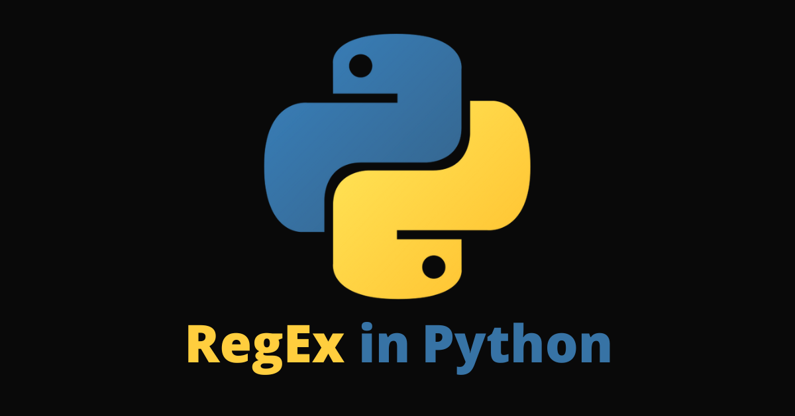

# 13. Expresións regulares



As expresións regulares en Python son unha poderosa ferramenta para buscar e manipular texto baseado en patróns específicos. O módulo `re` de Python proporciona funcións para traballar con expresións regulares.

Para importar dita librería tan só debemos:

```python
import re
```


