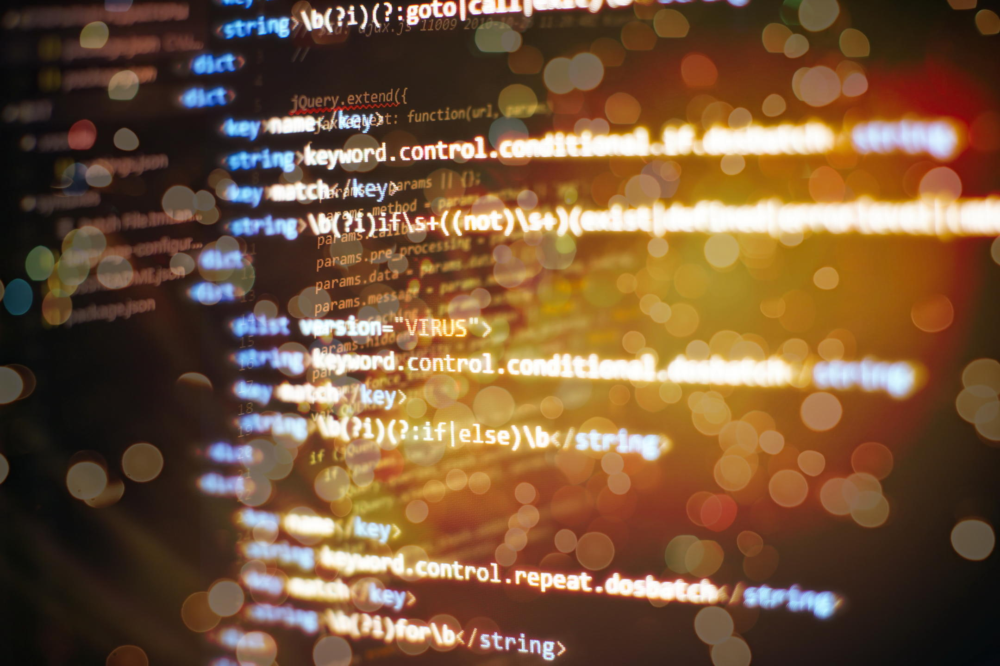

# 14. Datas e horas



Para traballar con datas e horas en Python deberemos usar o módulo `datetime`. Este módulo proporciona clases para manexar datas, horas, deltas de tempo e outras operacións relacións co tempo.

As tres clases principais son `datetime`, `date` y `time`.

Para importar o módulo tan só:

```python
import datetime
```