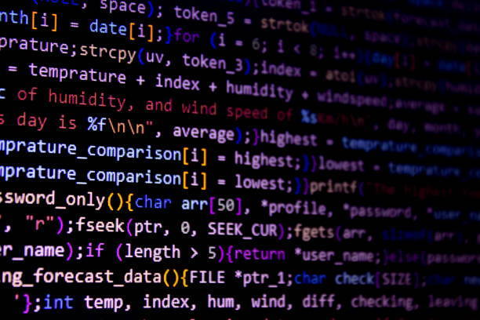

# 3. Biblioteca subprocess

Pódense executar comandos de Bash e PowerShell utilizando a biblioteca `subprocess`. Esta biblioteca proporciona un xeito de crear e xestionar procesos secundarios dende un *script* de Python.